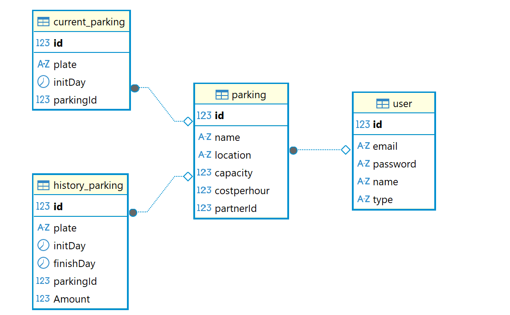

# 🚗 Parking API - Nelumbo Test

API REST en **NestJS** para la gestión de parqueaderos, usuarios y control de vehículos.  
Se comunica con un **microservicio de correos** para el envío simulado de notificaciones.

---
## 📂 MER



---
## 📂 Estructura del proyecto
```bash
parking-api/
├── src/
│ ├── auth/
│ ├── users/ 
│ ├── parking/ 
│ ├── current-parking/ 
│ ├── history-parking/ 
│ ├── app.module.ts # Configuración principal
│ └── main.ts # Punto de entrada
├── .env # Variables de entorno
├── package.json # Dependencias y scripts
└── README.md # Documentación

---

## 🐘 Levantar la base de datos con Docker

Ejecuta el siguiente comando para crear el contenedor de PostgreSQL:

docker run --name parkingPG \
  -e POSTGRES_PASSWORD=ParkingPass \
  -e POSTGRES_DB=parkingDB \
  -e POSTGRES_USER=AdminP \
  -p 5432:5432 \
  -d postgres:alpine


## ⚙️ Configuración

1. Clonar el repositorio:
   git clone https://github.com/JulianQuirozG/parking.git
   cd parking

2. Instalar dependencias:
    npm install


3. Crear un archivo .env en la raíz con las siguientes variables:
    DBHOST='localhost'
    DBPORT=5432
    DBUSER='AdminP'
    DBPASSWORD='ParkingPass'
    DBNAME='parkingDB'
    JWTSECRET='NELUMBO' 
    MICROSERVICEHOST='localhost:3001'

4. Ejecutar el servidor en watch mode:

    npm run start:dev
    El servicio quedará disponible en:
    http://localhost:3000   